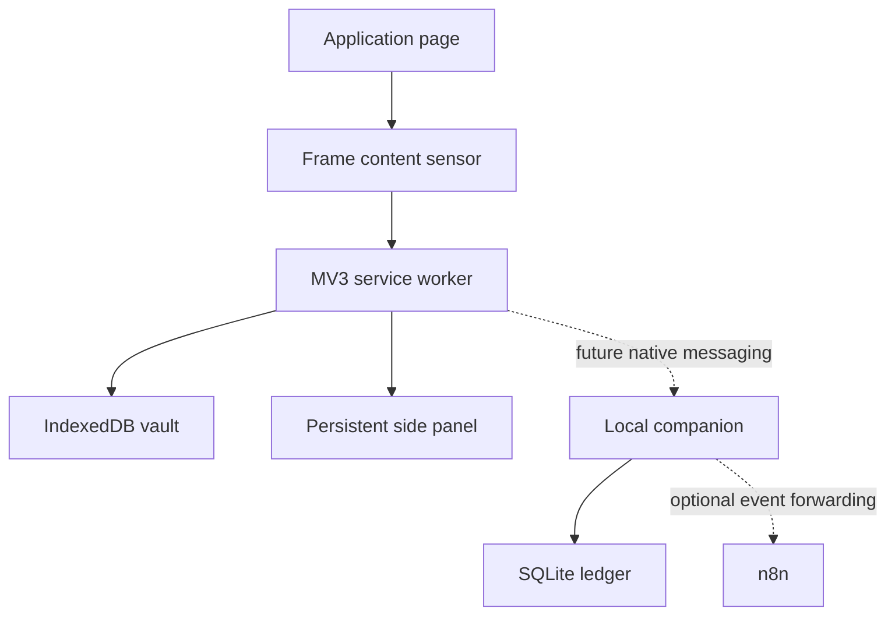

# Architecture

## Runtime topology

## Browser boundary

Each injectable frame is an independent sensor. The content script reads visible native and ARIA semantics, builds a typed `ApplicationPage`, and sends it to the service worker. The scanner excludes hidden and password controls. It never writes to the page in the current milestone.

The MV3 service worker is an ephemeral coordinator. Active page snapshots and the Master Profile are written to IndexedDB; no important state depends on service-worker memory.

The side panel is the user command center. Today it exposes application discovery, profile confirmation, and diagnostics. Pre-flight, résumé selection, answer review, and AutoPilot will be added behind explicit release gates.

## Contract boundary

`@munshi-apply/contracts` owns domain schemas and message shapes. Runtime data is parsed at trust boundaries. The semantic engine, application state model, extension, and native companion must use contract-compatible shapes rather than inventing private representations.

## Native boundary

The Python companion owns mature local persistence and external integrations. It supports:

- numbered SQLite migrations;
- a local health endpoint;
- structured application events;
- Chromium native-messaging framing;
- optional n8n forwarding with a dedicated webhook secret.

API provider credentials will live only in the companion environment. They must never enter extension source or browser storage.

## Trust and review model

Protected facts include identity, employment and education history, work authorization, sponsorship, and voluntary demographic choices. Learning can improve recognition of those questions; it cannot silently change their answers.

The deterministic semantic engine returns `UNKNOWN` when no supported concept matches. High-risk classifications require review even when the classifier is confident.
