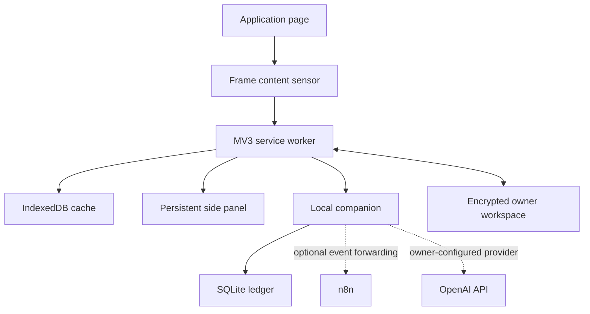

# Architecture

## Runtime topology

## Browser boundary

Each injectable frame is an independent sensor. The content script reads visible native and ARIA semantics, recursively discovers open Shadow DOM, builds a typed `ApplicationPage`, and sends it to the service worker. Password and hidden controls are excluded. Stable semantic fingerprints avoid tying ordinary controls to their current DOM ordering.

The content runtime observes structural and semantic mutations, input/change events, hash/popstate navigation, and History API route changes. It rescans after state changes rather than assuming a static application page.

The interaction path is separate from discovery. It accepts only an explicit `FillPlan` containing owner-approved answers. Supported text, textarea, select, checkbox, radio, and contenteditable controls are operated through native setters/events and then verified against DOM state. Unsupported controls fail visibly. File selection and security checkpoints remain manual, and the extension does not automatically press the employer's final submit control.

The MV3 service worker is an ephemeral coordinator. IndexedDB holds browser UI state, active application sessions, page snapshots, the local profile replica, and encrypted-cloud device material. It is not the authoritative durable application ledger. SQLite in the native companion is the system of record for durable local application/event history, while the encrypted owner workspace is the cross-device authority once synchronization is enabled.

The side panel is the desktop command center. It exposes current-application discovery and pre-flight answers, explicit per-answer approval, résumé selection metadata, guarded fill, the structured Profile editor with autosave, pairing/encryption controls, runtime diagnostics, and owner-controlled AI/API settings.

## Contract boundary

`@munshi-apply/contracts` owns domain schemas and message shapes. Runtime data is parsed at trust boundaries. The semantic engine, application state model, extension, and native companion use contract-compatible shapes rather than inventing private representations.

The deterministic semantic ontology includes distinct recurring identity, address, education, employment, authorization, preference, and protected-question concepts. Unknown wording remains `UNKNOWN`; consequential classifications require review rather than being coerced into a known field.

## Profile and synchronization boundary

Ordinary profile facts may autosave after a debounce. Protected facts become confirmed only after explicit owner completion. Profile writes are coalesced so a stale in-flight save cannot mark a newer edit clean.

When encrypted cloud synchronization is active, a successful save must converge to the exact profile version being acknowledged. If another device has changed the profile and the returned cloud value differs, the save is surfaced as a conflict instead of displaying a false synchronized state.

Cross-device payloads are encrypted by the client before durable cloud storage. The cloud control plane can coordinate versions and ciphertext without owning the plaintext workspace key.

## Native boundary

The Python companion owns mature local persistence and external integrations. It supports:

- numbered SQLite migrations;
- a local health endpoint;
- structured application events;
- Chromium native-messaging framing;
- an atomic transactional outbox;
- verified local backup/rollback operations;
- optional signed n8n forwarding with bounded retry and a dedicated webhook secret; and
- local AI provider configuration and macOS Keychain credential access.

An application event and its outbox record commit in the same SQLite transaction. External delivery occurs only after commit; an unavailable n8n endpoint cannot invalidate or block the local ledger.

Source/development verification and installed-runtime verification are intentionally separate. CI and development environments own formatting, linting, Ruff, Pytest, TypeScript tests, and source builds. The production native runtime contains production dependencies only; installed-runtime verification checks artifacts, SQLite/migrations, Native Messaging, native smoke health, and optional manifest registration without requiring developer-only packages.

The OpenAI API key never enters extension source, browser storage, synchronized profile records, or Git. On macOS it is stored in Keychain by the native companion. Non-secret AI preferences live under the backed-up private runtime `settings/` directory.

## Trust and review model

Protected facts include identity, work authorization, sponsorship, previous-employment/application answers when consequential, and voluntary demographic choices. Learning may improve recognition of those questions; it cannot silently change their answers.

The deterministic semantic engine returns `UNKNOWN` when no supported concept matches. High-risk classifications require review even when the classifier is confident. Generated application answers remain disabled until the evidence/retrieval and truth-validation gates are implemented.
